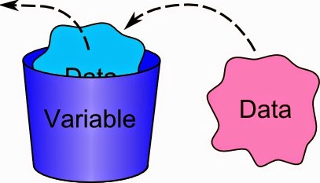
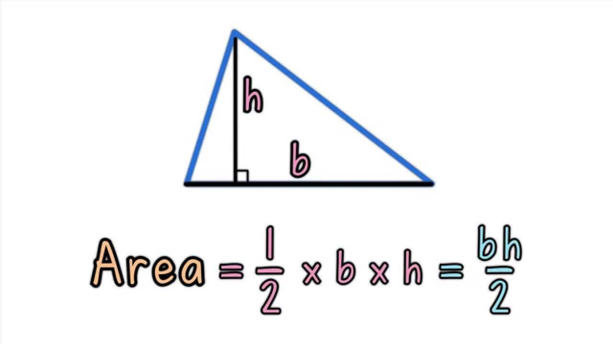
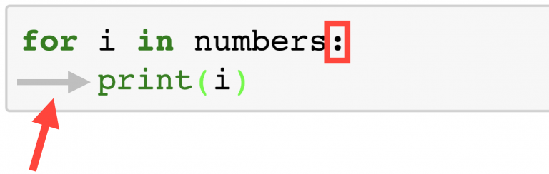

# 2 - Functions and Loops

Congratulations on making it to lesson two! Hopefully now you have a basic understanding of what Python is, and some of the data structures we can use. Before we begin this week's lesson, here's a quick recap.

---

## Variables

Variables places where we can store values. You can think of a variable as being like a box with a name in it. 



In Python we assign a variable by using the equals (`=`) sign. 

```python
a = 5
b = 'hello!'
c = [1, 2, 3]
```

To check what's inside the variable, we can print it out

```python
print(a)
print(b)
print(c)
```

## Comments

In Python, anything which follows a hashtag (`#`) is ignored. This is called a comment and is useful for describing what the code is doing

```python
# this will just be ignored :'(
```

## Types

There are many possible types of data we can deal with in Python. Last week we looked at three basic ones: numbers, strings and lists. 

```python
a = 5            # this is a number
b = 'hello!'     # this is a string
c = [1, 2, 3]    # this is a list
```

## Maths

When dealing with numbers, we can do all the usual maths operations. 

```python
a = 5
b = 10
print(a + b)    # addition
print(a * b)    # multiplication
```

## Lists

Lists are a special type in Python because they contain other things. We can access individual items by using square brackets. But remember, the items start from zero!

```python
         #   0        1     2    3      4
my_list = ['dog', 'turkey', 65, 100, 'parrot']
print(my_list[0])     # this will print 'item 0'
print(my_list[3])     # this will print 100
```

We can also override individual items
```python
my_list2 = [5, 6, 7, 8]
my_list[0] = 100
# now the list is [100, 6, 7, 8]
```

We can add a new item onto the end of the list by using the key word 'append'. 

```python
my_list3 = [5, 'sheep', 17]
my_list3.append('fish')
# now the list is [5, 'sheep', 17, 'fish']
```

In python there are some special things we can do on lists. 

```python
my_list4 = [2, 4, 6, 8, 10]
len(my_list4)    # the tells me the length of the list
sum(my_list4)    # this adds the list up. But they must all be numbers!
max(my_list4)    # this tells me the biggest number in a list
min(mu_list4)    # this tells me the smallest number in a list
```

## Conditions

In programming, we often want to decide whether or not to do something. For this, we use the key words 

```python
if
```
and 

```python
else
```

like this 

```python
a = 100
b = 200

if a > b:
    print('100 is greater than 200???')
else:
    print('phew, maths still exists')
```


# New Topic: Functions!

We will now move on to a new topic: functions. Functions are one of the most important things in programming and you will find them in every language. You can think of a function as a machine that takes something in, and produces something new


For example, we could take in a number and output that number squared. Or we could take in a list, and output that list in reversed order. There are many many possibilities. 

## How to make a function in Python

**Step 1**. In Python, we create a new function by using the keyword 


```python 
def
```

which is short for *define*. 

**Step 2**. Next, we have to give our function a name. Just like with variables, this name can be anything you like

```python
def squared
```

**Step 3**. Now we need to tell the function what to expect as an input. In this example our function will take in one thing, which we will call `x`. 

```python
def squared(x)
```

**Step 4**. Now we need to decide what the function does to that input. Like with conditions, we have to put a colon (`:`) and a tab (four spaces). Then we say what goes on inside our machine. This will be normal code. 

```python
def squared(x):
    y = x * x
```

**Step 5**. Finally, we tell our machine what to output by using the keyword 

```python
return
```

So our whole function reads


```python
def squared(x):
    y = x * x
    return y
```

**Step 6**. We can now use that function as many times as we like, anywhere in our code

```python
a = squared(5)
print(a)    # this will print 25
```

## Exercise 1

Copy out the function `squared` from above and enter it into a code cell. Try testing it out by creating some new variables and printing them. 


```python
# Exercise 1: YOUR CODE HERE
```

## Exercise 2

Look carefully at the function called `squared` you have just written. Now, try writing a new function called `add_one`. This function will look very similar, but instead of returning `x` squared, this time make it return the number *plus one*. Write your code below and test it. 


```python
# Exercise 2: YOUR CODE HERE
```

## Multiple Inputs

Sometimes we will want to make a machine that takes two or more things and combines them in some way to produce something new. Imagine a factory that makes ice cream. We might have a machine that takes milk, sugar and chocolate then mixes and freezes them to make the ice cream. We want to do something similar here. 

When we define our function, we can tell it to take more than one thing. The function below shows how we can calculate the area of a triangle given its width and its height. Recall from maths class that we can find the area of a triangle by doing 

$$
\text{area} = \frac{\text{base} \times \text{height}}{2}
$$



Lets write a function that does that!

```python
def triangle_area(base, height):
    area = (base * height) / 2
    return area
```

Now lets try running that function on some real values

```python
triangle_width = 10
triangle_height = 15

my_area = triangle_area(triangle_width, triangle_height)
print(my_area)    # this will print 75
```


## Exercise 3

Copy the code above into a new code cell. Try running it with some numbers of your own!


```python
# Exercise 3: YOUR CODE HERE
```

## Exercise 4

Last week we looked at finding the mean and range of a list using the functions 

```python
len
sum
max 
min
```

Now, you're going to do the same thing but we will make it a function. Your task is to design two functions: one called `list_mean` and the other called `list_range`. Both these functions should take **one argument** which will be a list. Then they should return the **mean** of that list and the **range** of that list respectively. 


```python
# Excercise 4a: YOUR CODE HERE


# # Excercise 4b: YOUR CODE HERE


```

# New topic: Loops!

There are many times in programming when we want to repeat some action over and over again. Lets say, for example we have the base and height of 100 triangles. We could write some code that looks like this 

```python 
area1 = triangle_area(base1, height1)
area2 = triangle_area(base2, height2)
area3 = triangle_area(base3, height3)
...
area99 = triangle_area(base99, height99)
area100 = triangle_area(base100, height100)
```

But this would take a long time to type! There must be a better way, and there is: *loops*.

Loops are a way of telling the computer to keep doing something. There are a couple of ways of doing this, but usually the best way in Python is to make use of whats called a *for loop*. 


## For loops

The basic idea behind a for loop is that we want to go through each item in a list or sequence. Let's look at an example

```python
dog = ['Freddie', 9, True, 1.1, 2001, ['frog', 'football']]

for item in dog:
    print(item)
```

You can read this as 'for each item in the list `dog`, print that item'. Notice that we didn't have to call each thing `item` - we could have called it anything. 

```python

# These  both achieve the exact same thing
for i in dog:
    print(i)
    
for item_in_dog in dog:
    print(item_in_dog)
```

## Exercise 5

Copy the python above into a new cell and run it. What do you notice? Try making your own example


```python
# YOUR CODE HERE
```

A really common situation in Python is when we want to go through a list of ascending numbers: something like this

```python
numbers = [0, 1, 2, 3, 4, 5, 6, 7, 8, 9]

for i in numbers:
    print(i)   
```

This situation is so common, that we have a special function for it called *range*. The code below does exactly the same thing as the code above

```python
numbers = range(10)

for i in numbers:
    print(i)  
```

So you can think of 

```python
range(10)
```

as being a list of numbers going from 0 to 9. 

In general, `range()` can take up to three arguments


Here

* **The first element**  is number that the range starts from 

* **The last element** is actually the element *after* your last. `range(0, 4, 1)` is [0, 1, 2, 3]; `range(0, 5, 1)` is [0, 1, 2, 3, 4]

* **The step** is the difference between each number in the range

But by far the most common way to see this is just with one number

```python
range(20)
range(100)
range(1000000)    # etc. 
```

## A common mistake!

Just like with `if` statements and functions, make sure you always use a colon `(:)` and a tab!




## Exercise 6

Experiment with looping through some different ranges


```python
# YOUR CODE HERE

```

## Back to triangles

Recall from before when we had 100 different triangles for which we wanted to calculate the area. Lets say we collected all the bases and heights into two different lists of length 100 called `bases` and `heights`. We now want to make a new list containing all the areas called `areas`. We could do this like so

```python
bases =   [3, 5, 4, 7, 5, ... 9]   # these are the bases
heights = [5, 3, 6, 8, 7, ... 3]   # these are the heights
areas =   []    # we start by making an empty list to hold the areas

for i in range(100):
    area = triangle_area(bases[i], heights[i])    
    areas.append(area)
```

Notice here we have used the variable `i` to index our `bases` and `heights` list. 


## Exercise 7

Let's say we went to a school and measured the height of every student in each class. Our goal is to find the average height of each class, in order to find the class with the tallest average student. Below you'll see the data that was collected, measured in cm. Each class is represented as a list where each student's height is recorded. 

Using your function `list_mean` which you defined earlier, write a piece of code to find the average height of each class. There may be multiple different correct ways to do this! Have a think and look at the earlier examples where you need to. 


```python
data = [ [144, 144, 133, 146, 164, 136, 154, 153],                      # class 7a
         [154, 143, 151, 152, 140, 148, 142, 145, 157, 143],            # class 7b
         [142, 147, 135, 151, 148, 147, 169, 147, 140, 162, 158, 153],  # class 7c
         [159, 169, 162, 164, 163, 162, 163, 159, 172],                 # class 8a
         [181, 168, 163, 164, 151, 166, 160, 172, 161, 166, 161],       # class 8b
         [157, 162, 163, 157, 160, 166, 161, 173, 169, 160, 168, 150],  # class 8c
         [164, 174, 161, 174, 173, 163, 166, 165, 174, 166],            # class 9a
         [157, 169, 164, 171, 164, 182, 162, 176],                      # class 9b 
         [166, 172, 170, 173, 160, 166, 174, 182, 159, 166]]            # class 9c

# YOUR CODE HERE

```
